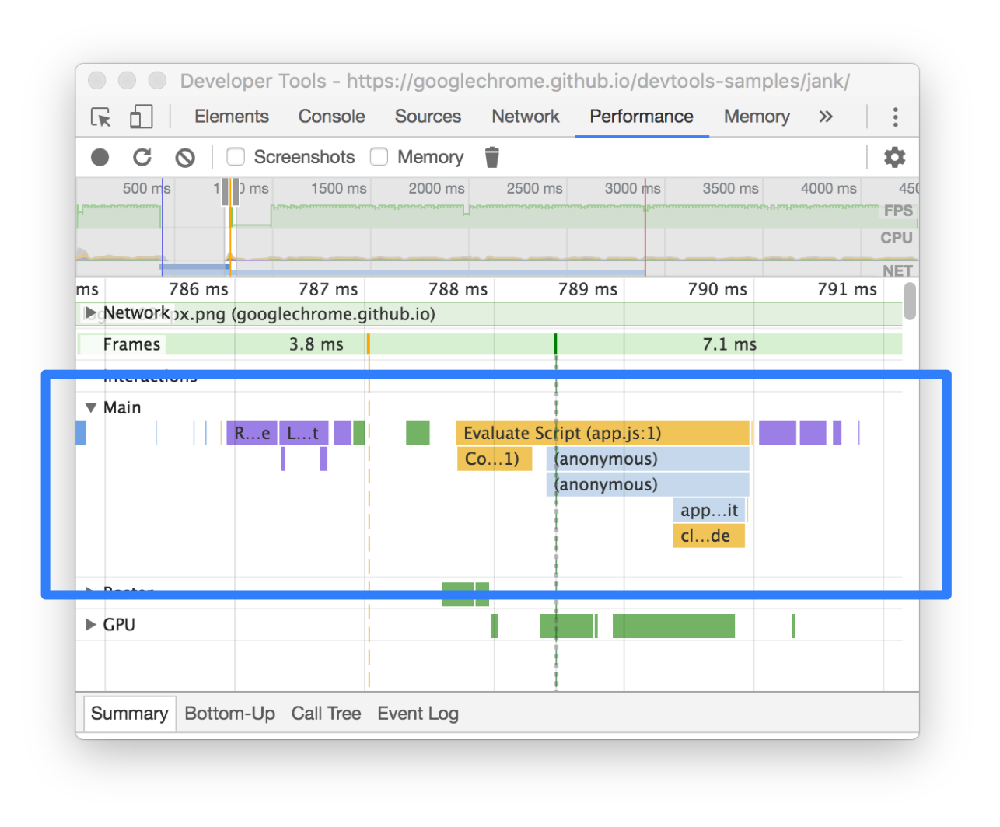

# [分析运行时性能](https://developer.chrome.com/docs/devtools/performance?hl=zh-cn)

运行时性能是指网页在运行时（而不是加载）时的性能。本教程介绍了如何使用 Chrome 开发者工具的性能面板来分析运行时性能。就 [RAIL](https://web.dev/articles/rail?hl=zh-cn) 模型而言，您在本教程中学到的技能对于分析页面的响应、动画和空闲阶段非常有用。

## 使用教程

在本教程中，您将在实际页面上打开开发者工具，并使用“Performance”面板查找页面上的性能瓶颈。

<ol>
<li> 在无痕模式下打开 Google Chrome。无痕模式可确保 Chrome 在干净的状态下运行。例如，如果您安装了许多扩展程序，这些扩展程序可能会在性能测量结果中产生噪声。</li>
<li>在无痕式窗口中加载以下网页。这是您要分析的演示。页面上显示了一堆上下移动的蓝色小方块。
</li>

https://googlechrome.github.io/devtools-samples/jank/

<li>按 Command+Option+I (Mac) 或 Ctrl+Shift+I（Windows、Linux）以打开开发者工具。
</li>

</ol>

### 模拟移动设备 CPU

与台式机和笔记本电脑相比，移动设备的 CPU 性能要低得多。每次分析网页时，您都可以使用 CPU 节流来模拟网页在移动设备上的性能。

<ol>
<li> 在开发者工具中，点击性能标签页。</li>
<li>确保已选中屏幕截图复选框。</li>
<li>点击 Capture Settings 图标 拍摄设置。 开发者工具会显示与捕获性能指标的方式相关的设置。
</li>
<li>对于 CPU，选择 2 倍减速。开发者工具会限制您的 CPU 速度，使其比平常慢 2 倍。
</li>
</ol>

### 设置演示

想要创建一个适合此网站所有读者的运行时性能演示，很难做到这一点。在本部分中，您可以自定义演示，以确保您的体验与本教程中显示的屏幕截图和说明相对一致，无论您的特定设置如何。

<ol>
<li>不断点击添加 10，直到蓝色方块的移动速度明显比之前更慢。在高端机器上，此过程可能需要大约 20 次点击。
</li>
<li>点击优化。蓝色方块会更快、更平稳地移动。</li>
<li>点击取消优化。蓝色方块移动较慢，并再次出现卡顿现象。</li>
</ol>

> 注意：如果优化版本和非优化版本之间没有明显差异，请尝试点击几次减去 10，然后重试。如果添加的蓝色方块过多，只会让 CPU 占用率达到上限，而且两个版本的结果不会有很大差异。

### 记录运行时性能

运行经过优化的页面后，蓝色方块的移动速度会更快。Why is that? 这两个版本应在相同的时间内为每个方块移动相同量的空间。录制“性能”面板中的记录，了解如何在未优化版本中检测性能瓶颈。

<ol>
<li>在开发者工具中，点击 Record 图标 录制。开发者工具会在页面运行时捕获性能指标。
</li>

<li>点击优化。蓝色方块会更快、更平稳地移动。</li>
<li>点击取消优化。蓝色方块移动较慢，并再次出现卡顿现象。</li>

</ol>

## 分析结果

获得网页性能的记录后，您就可以衡量网页性能不佳并找出原因。

### 分析每秒帧数

量任何动画性能的主要指标都是每秒帧数 (FPS)。如果动画以 60 FPS 运行，用户会感到满意。

<ol>
<li>查看 FPS 图表。如果您看到 FPS 以上出现红条，则表示帧速率下降得非常低，以至于可能会影响用户体验。一般来说，绿条越高，FPS 越高。
</li>

<li>在 FPS 图表下方，您会看到 CPU 图表。CPU 图表中的颜色对应于“性能”面板底部的摘要标签页中的颜色。CPU 图表是全彩色的这一事实意味着，在记录期间 CPU 已用尽。只要发现 CPU 长时间达到上限，系统就会提示设法减少工作量。</li>

<li>将鼠标悬停在 FPS、CPU 或 NET 图表上。此时，开发者工具会显示页面的屏幕截图。左右移动鼠标可重放录制内容。这称为拖拽，有助于手动分析动画的进度。</li>

</ol>

4、在帧部分中，将鼠标悬停在其中一个绿色方块上。开发者工具会显示该特定帧的 FPS。每一帧都可能远低于 60 FPS 的目标。

当然，通过此演示，很明显网页性能不好。但在实际情况下，可能没有那么清晰，因此使用所有这些工具进行测量会派上用场。

### 额外知识点：打开 FPS 表

另一个便捷工具是 FPS 计量器，它可以在网页运行时提供 FPS 的实时估算值。

<ol>
<li>按 Command+Shift+P (Mac) 或 Ctrl+Shift+P（Windows、Linux）以打开命令菜单。</li>
<li>首先在“命令”菜单中输入 Rendering，然后选择 Show Rendering。</li>
<li>在 Rendering 标签页中，启用 FPS Meter。一个新的叠加层随即会显示在视口的右上角。</li>
<li>停用 FPS Meter 并按 Esc 键，以关闭 Rendering 标签页。本教程不会用到它。</li>
</ol>

### 找出瓶颈

现在，您已经测量并验证了动画性能不佳，接下来要回答的问题是：为什么？

<ol>
<li>请注意“summary”标签页。如果未选择事件，此标签页会显示活动明细。 网页将大部分时间花在了呈现上。由于性能是减少工作量的艺术，因此您的目标是减少在渲染工作上花费的时间。</li>

<li>
展开 Main 部分。开发者工具会向您显示主线程上的活动随时间变化的火焰图。x 轴表示一段时间内的记录。每个条形都代表一个事件。横条越宽，表示事件用时越长。y 轴表示调用堆栈。如果您看到事件相互堆叠，则表示上层事件导致了下层事件。

</li>

<li>
录制中包含大量数据。通过点击、按住并将鼠标悬停在 Overview（包含 FPS、CPU 和 NET 图表的部分）上，放大单个 Animation Frame Fired 事件。Main 部分和 Summary 标签页仅显示录制内容选定部分的信息。
</li>

> 注意：另一种缩放方式是聚焦于 Main 部分，方法是点击其背景或选择事件，然后按 W、A、S 和 D 键。

<li>
请注意 Animation Frame Fired 事件右上角的红色三角形。如果您看到红色三角形，则表示可能存在与此事件相关的问题。
</li>

> 注意：每当执行 requestAnimationFrame() 回调时，都会发生 Animation Frame Fired 事件。

<li>
点击已触发动画帧事件。摘要标签页现在会显示该事件的相关信息。请注意显示链接。点击该按钮后，开发者工具会突出显示启动 Animation Frame Fired 事件的事件。另请注意 app.js:94 链接。点击此链接将跳转到源代码中的相关行。
</li>

<li>
app.update 事件下有很多紫色事件。如果它们再宽一些，看起来就像每个条形上都有一个红色三角形。现在，点击其中一个紫色 Layout 事件。开发者工具会在摘要标签页中提供有关该事件的更多信息。确实，有关于强制自动重排的警告（布局的另一个词）。
</li>
<li>
在摘要标签页中，点击强制布局下的 app.js:70 链接。开发者工具会带您前往强制执行布局的代码行。
</li>

</ol>

### 额外知识点：分析经过优化的版本

使用您刚刚学习的工作流和工具，点击演示中的优化以启用优化的代码，再录制一次性能，然后分析结果。从提高帧速率到减少 Main 部分火焰图中的事件减少，您可以看到，优化版应用执行的工作量大幅减少，从而提升性能。

## 后续步骤

了解性能的基础是 RAIL 模型。此模型可以告诉您对用户而言最重要的性能指标。如需了解详情，请参阅[使用 RAIL 模型测量性能](https://web.dev/articles/rail?hl=zh-cn)。

为了更加熟悉“性能”面板，熟能生巧。请尝试分析您自己的网页并分析结果。如果您对结果有任何疑问，请[打开带有 google-chrome-devtools 标记的 Stack Overflow 问题](https://stackoverflow.com/users/login?ssrc=anon_ask&returnurl=https%3a%2f%2fstackoverflow.com%2fquestions%2fask%3ftags%3dgoogle-chrome-devtools)。如果可能，请提供屏幕截图或指向可重现网页的链接。

为了成为运行时性能方面的专家，您必须了解浏览器如何将 HTML、CSS 和 JS 转换为屏幕上的像素。建议您首先查看渲染性能概览。[《The Anatomy Of A Frame》](https://aerotwist.com/blog/the-anatomy-of-a-frame/)深入介绍了更多详细信息。

最后，有很多方法可以提高运行时性能。本教程重点介绍一个特定的动画瓶颈，以便重点引导您浏览“性能”面板，但这只是您可能会遇到的众多瓶颈之一。“渲染性能”系列的其余部分包含许多有关如何改进运行时性能各个方面的实用提示，例如：

-   [优化 js](https://web.dev/articles/optimize-javascript-execution?hl=zh-cn)
-   [缩小样式计算的范围并降低复杂性](https://web.dev/articles/reduce-the-scope-and-complexity-of-style-calculations?hl=zh-cn)
-   [避免大型、复杂的布局和布局抖动](https://web.dev/articles/avoid-large-complex-layouts-and-layout-thrashing?hl=zh-cn)
-   [简化绘制的复杂性并减小绘制区域](https://web.dev/articles/simplify-paint-complexity-and-reduce-paint-areas?hl=zh-cn)
-   [坚持仅使用合成器的属性并管理层数](https://web.dev/articles/stick-to-compositor-only-properties-and-manage-layer-count?hl=zh-cn)
-   [使输入处理程序去除抖动 ](https://web.dev/articles/debounce-your-input-handlers?hl=zh-cn)
