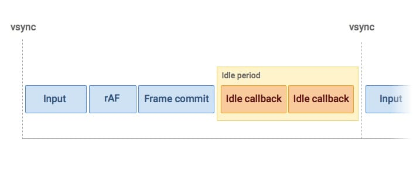

# [使用 requsetIdleCallback](https://developer.chrome.com/blog/using-requestidlecallback?hl=en)

## 为什么我们要使用 requestIdleCallback？

自行安排非必要的工作非常困难。因为在 requestAnimationFrame 回调执行后，还有样式计算、布局、绘制和其他浏览器内部程序需要运行，所以不可能准确计算出还剩下多少帧时间。自滚动解决方案无法考虑这些因素。为了确保用户没有以某种方式进行交互，你还需要为每一种交互事件（滚动、触摸、点击）附加监听器，即使你不需要它们来实现功能，这样你才能绝对确保用户没有进行交互。另一方面，浏览器清楚地知道帧末有多少时间可用，以及用户是否在进行交互，因此通过 requestIdleCallback，我们获得了一个 API，可以最有效地利用任何空闲时间。

让我们更详细地了解一下它，看看如何利用它。

## 检查 requestIdleCallback

requestIdleCallback 还处于早期阶段，因此在使用前应检查它是否可用：

```javascript
if ("requestIdleCallback" in window) {
    // Use requestIdleCallback to schedule work.
} else {
    // Do what you’d do today.
}
```

## 使用

调用 requestIdleCallback 与 requestAnimationFrame 非常相似，都是将回调函数作为第一个参数：

```javascript
requestIdleCallback(myNonEssentialWork);
```

调用 myNonEssentialWork 时，会得到一个 deadline 对象，该对象包含一个函数，该函数返回一个数字，表示你的工作还剩多少时间：

```javascript
function myNonEssentialWork(deadline) {
    while (deadline.timeRemaining() > 0) doWorkIfNeeded();
}
```

可以调用 timeRemaining 函数来获取最新值。当 timeRemaining() 返回零时，如果还有更多工作要做，就可以安排另一个 requestIdleCallback：

```javascript
function myNonEssentialWork(deadline) {
    while (deadline.timeRemaining() > 0 && tasks.length > 0) doWorkIfNeeded();

    if (tasks.length > 0) requestIdleCallback(myNonEssentialWork);
}
```

## 确保您的函数被调用

如果主线程非常繁忙，您该怎么办？你可能会担心你的回调可能永远不会被调用。尽管 requestIdleCallback 与 requestAnimationFrame 很相似，但它也有不同之处，那就是它有一个可选的第二个参数：一个带有超时属性的选项对象。如果设置了超时，浏览器就必须在以毫秒为单位的时间内执行回调：

```javascript
// Wait at most two seconds before processing events.
requestIdleCallback(processPendingAnalyticsEvents, { timeout: 2000 });
```

如果您的回调因超时启动而被执行，您会注意到两件事：

-   timeRemaining() 将返回 0。
-   deadline 对象的 didTimeout 属性将为 true。

如果您发现 didTimeout 为 true，那么您很可能只想运行工作，然后就完事了(and be done with it)：

```javascript
function myNonEssentialWork(deadline) {
    // Use any remaining time, or, if timed out, just run through the tasks.
    while (
        (deadline.timeRemaining() > 0 || deadline.didTimeout) &&
        tasks.length > 0
    )
        doWorkIfNeeded();

    if (tasks.length > 0) requestIdleCallback(myNonEssentialWork);
}
```

由于超时可能会对用户造成干扰（工作可能会导致应用程序反应迟钝或不流畅），因此在设置此参数时一定要谨慎。在可能的情况下，让浏览器决定何时调用回调。

## 使用 requestIdleCallback 发送分析数据

让我们看看如何使用 requestIdleCallback 发送分析数据。在这种情况下，我们可能希望跟踪一个事件，比如点击导航菜单。不过，由于它们通常是屏幕上的动画，因此我们希望避免立即将此事件发送到 Google Analytics。我们将创建一个要发送的事件数组，并请求在未来某个时间点发送这些事件：

```javascript
var eventsToSend = [];

function onNavOpenClick() {
    // Animate the menu.
    menu.classList.add("open");

    // Store the event for later.
    eventsToSend.push({
        category: "button",
        action: "click",
        label: "nav",
        value: "open",
    });

    schedulePendingEvents();
}
```

现在，我们需要使用 requestIdleCallback 来处理任何待处理的事件：

```javascript
function schedulePendingEvents() {
    // Only schedule the rIC if one has not already been set.
    if (isRequestIdleCallbackScheduled) return;

    isRequestIdleCallbackScheduled = true;

    if ("requestIdleCallback" in window) {
        // Wait at most two seconds before processing events.
        requestIdleCallback(processPendingAnalyticsEvents, { timeout: 2000 });
    } else {
        processPendingAnalyticsEvents();
    }
}
```

在这里，你可以看到我设置了 2 秒的超时时间，但这个值取决于你的应用程序。对于分析数据来说，超时的意义在于确保数据在合理的时间范围内报告，而不是仅仅在未来的某个时间点报告。

最后，我们需要编写 requestIdleCallback 将执行的函数。

```javascript
function processPendingAnalyticsEvents(deadline) {
    // Reset the boolean so future rICs can be set.
    isRequestIdleCallbackScheduled = false;

    // If there is no deadline, just run as long as necessary.
    // This will be the case if requestIdleCallback doesn’t exist.
    if (typeof deadline === "undefined")
        deadline = {
            timeRemaining: function() {
                return Number.MAX_VALUE;
            },
        };

    // Go for as long as there is time remaining and work to do.
    while (deadline.timeRemaining() > 0 && eventsToSend.length > 0) {
        var evt = eventsToSend.pop();

        ga("send", "event", evt.category, evt.action, evt.label, evt.value);
    }

    // Check if there are more events still to send.
    if (eventsToSend.length > 0) schedulePendingEvents();
}
```

在这个示例中，我假设如果 requestIdleCallback 不存在，分析数据应立即发送。不过，在生产应用程序中，最好还是延迟发送并设置超时，以确保不会与任何交互发生冲突，从而避免出现错误。

## 使用 requestIdleCallback 对 DOM 进行更改

requestIdleCallback 能真正帮助提高性能的另一种情况是需要对 DOM 进行非必要的更改，例如在不断增长的懒加载列表末尾添加项目。让我们看看 requestIdleCallback 在典型框架中的实际应用。

浏览器有可能因为太忙而无法在某一帧中运行任何回调，所以你不应该指望在一帧结束时会有空闲时间来做更多的工作。这使得它不同于 setImmediate 等按帧运行的方法。

如果回调在帧结束时触发，它将被安排在当前帧提交后进行，这意味着样式更改已经应用，更重要的是，布局计算也已完成。如果我们在 requestIdleCallback 中更改 DOM，这些布局计算将失效。如果下一帧有任何布局读取，如 getBoundingClientRect、clientWidth 等，浏览器将不得不执行[强制同步布局](https://web.dev/articles/avoid-large-complex-layouts-and-layout-thrashing?hl=zh-cn#avoid-forced-synchronous-layouts)，这可能会成为性能瓶颈。

不在空闲回调中触发 DOM 更改的另一个原因是，更改 DOM 对时间的影响是不可预测的，因此我们很容易超过浏览器提供的截止时间。

最好的做法是只在 requestAnimationFrame 回调中更改 DOM，因为浏览器在调度时会考虑到这种类型的工作。这意味着我们的代码需要使用文档片段，然后在下一个 requestAnimationFrame 回调中添加该片段。如果您使用的是 VDOM 库，您可以使用 requestIdleCallback 进行更改，但会在下一次 requestAnimationFrame 回调中应用 DOM 修补程序，而不是空闲回调。

有鉴于此，让我们来看看代码：

```javascript
function processPendingElements(deadline) {
    // If there is no deadline, just run as long as necessary.
    if (typeof deadline === "undefined")
        deadline = {
            timeRemaining: function() {
                return Number.MAX_VALUE;
            },
        };

    if (!documentFragment) documentFragment = document.createDocumentFragment();

    // Go for as long as there is time remaining and work to do.
    while (deadline.timeRemaining() > 0 && elementsToAdd.length > 0) {
        // Create the element.
        var elToAdd = elementsToAdd.pop();
        var el = document.createElement(elToAdd.tag);
        el.textContent = elToAdd.content;

        // Add it to the fragment.
        documentFragment.appendChild(el);

        // Don't append to the document immediately, wait for the next
        // requestAnimationFrame callback.
        scheduleVisualUpdateIfNeeded();
    }

    // Check if there are more events still to send.
    if (elementsToAdd.length > 0) scheduleElementCreation();
}
```

在这里，我创建了元素并使用 textContent 属性来填充它，但你的元素创建代码可能会更复杂！创建元素后，会调用 scheduleVisualUpdateIfNeeded，它将设置一个 requestAnimationFrame 回调，反过来将文档片段追加到正文中：

```javascript
function scheduleVisualUpdateIfNeeded() {
    if (isVisualUpdateScheduled) return;

    isVisualUpdateScheduled = true;

    requestAnimationFrame(appendDocumentFragment);
}

function appendDocumentFragment() {
    // Append the fragment and reset.
    document.body.appendChild(documentFragment);
    documentFragment = null;
}
```

现在，在 DOM 中添加项目时，我们可以看到更少的垃圾。非常好

## FAQ

-   **如果超过 deadline 会怎样？** 如果 timeRemaining() 返回零，但您选择运行更长的时间，那么您可以这样做，而不必担心浏览器会停止您的工作。不过，浏览器会为您设定最后期限，以确保为用户提供流畅的体验，因此除非有非常充分的理由，否则您应该始终遵守最后期限。

-   **我是否会在一帧结束时总是收到 requestIdleCallback？** 不，并非总是如此。浏览器会在一帧结束时或用户不活动的时间段安排回调。如果要求在给定时间内运行，则应使用 setTimeout。
