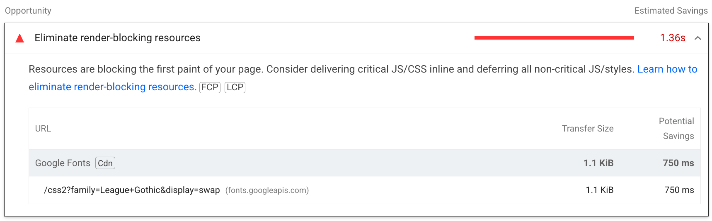

# [了解关键路径](https://web.dev/learn/performance/understanding-the-critical-path?hl=zh-cn)

## 关键渲染路径

### 关键渲染路径上有哪些资源？

浏览器需要等待一些关键资源下载完毕，然后才能完成初始渲染。这些资源包括：

-   HTML 的一部分。
-   <head> 标签中阻塞渲染的 CSS 样式。
-   <head> 标签中的阻塞渲染的 JavaScript 代码。

关键在于浏览器以流式方式处理 HTML。浏览器一旦获取网页 HTML 的任何部分，就会开始对其进行处理。然后，浏览器就可以（并且通常确实）决定先呈现网页，然后再接收网页的其余部分 HTML。

重要的是，在首次渲染时，浏览器通常不会等待：

-   所有的 html
-   fonts
-   images
-   在 <head> 标签之外不会阻塞渲染的 javascript 代码（例如，放在 html 最后面的 <script> 标签）
-   在 <head> 标签之外不会阻塞渲染的 css 样式，或者是拥有媒体查询的属性值的 css 样式，它不会运用于当前视口

字体和图像通常被浏览器视为后续页面重载时需要填充的内容，因此，它们不需要占用初始渲染的时间。不过，这可能意味着，在隐藏文本等待字体或图像可用之前，初始渲染中会留下空白区域。更糟糕的是，如果没有为某些类型的内容预留足够的空间，特别是 HTML 中没有提供图片尺寸，那么在以后加载这些内容时，页面的布局就会发生变化。用户体验的这一方面是通过累积[布局偏移（CLS)](https://web.dev/articles/cls)指标来衡量的。

不过，并非 <head> 元素中引用的所有资源都是首次呈现网页所必需的，因此浏览器只会等待那些资源。为了确定哪些资源处于关键渲染路径中，您需要了解阻塞渲染和解析器的 CSS 和 JavaScript。

### 阻塞渲染的资源(Render-blocking resources)

有些资源被认为非常关键，以至于浏览器会暂停网页呈现，直到它处理完毕。CSS 默认属于此类别。

当浏览器看到 CSS（无论是 <style> 元素中的内嵌 CSS，还是由 <link rel=stylesheet href="..."> 元素指定的外部引用的资源）时，浏览器在完成对该 CSS 的下载和处理之前，将避免呈现更多内容。

> 注意：尽管 CSS 默认会阻塞渲染，但也可以通过更改 <link> 元素的 media 属性来指定与当前条件不匹配的值，将其转换为不阻塞渲染的资源：<link rel=stylesheet href="..." media=print>。 过去已使用此方法，以允许非关键 CSS 以不阻塞渲染的方式加载。

资源阻塞渲染并不一定意味着它会阻止浏览器执行任何其他操作。浏览器会尽可能地提高效率，因此，当浏览器发现需要下载某项 CSS 资源时，它会请求该 CSS 资源并暂停渲染，但仍会继续处理其余 HTML 并寻找其他工作。

不过，并非 <head> 元素中引用的所有资源都是初始页面呈现所严格需要的，因此浏览器只会等待那些需要的资源。要确定哪些资源处于关键呈现路径，需要了解呈现阻塞和解析器阻塞 CSS 和 JavaScript。

### 阻塞解析器的资源(Parser-blocking resources)

阻塞解析器的资源是指那些阻止浏览器通过继续解析 HTML 来寻找要执行的其他工作的资源。默认情况下，JavaScript 会阻塞解析器（除非明确标记为异步或延迟），因为 JavaScript 可能会在执行时更改 DOM 或 CSSOM。因此，在了解所请求 JavaScript 对网页 HTML 造成的全部影响之前，浏览器就不可能继续处理其他资源。因此，同步 JavaScript 会阻止解析器。

阻塞解析器的资源实际上也是阻碍呈现的。由于解析器在完成解析之前无法继续跳过会阻塞解析的资源，因此它无法访问和呈现它之后的内容。浏览器在等待期间可以呈现到目前为止所收到的任何 HTML，但在涉及关键呈现路径的情况下，<head> 中任何阻止解析器的资源实际上意味着，所有网页内容都被阻止呈现。

阻塞解析器可能会消耗巨大的性能成本，远不止阻塞渲染的成本。因此，浏览器会使用辅助 HTML 解析器（称为预加载扫描程序）在主要 HTML 解析器被屏蔽时下载即将到来的资源，从而降低此成本。虽然不如实际解析 HTML 好，但至少允许浏览器中的网络功能先于被屏蔽的解析器运行，这意味着它将来再次被屏蔽的可能性更小。

### 识别阻塞资源(Identifying blocking resources)

许多性能审计工具都能识别出渲染和解析器阻塞资源。[WebPageTest](https://www.webpagetest.org/?__cf_chl_rt_tk=ZFMAK9971VPZ4KdxdiXxzGaPmc1qGr9oOYOhkMs_5Ho-1712903684-0.0.1.1-1578) 会在资源 URL 的左侧用橙色圆圈标记呈现阻塞资源：

在开始渲染之前，需要下载并处理所有渲染受阻的资源，瀑布图中的深绿色实线就是证明。

Lighthouse 还会高亮显示渲染阻塞资源，但会以一种更微妙的方式显示，而且只有当该资源确实会延迟页面渲染时才会显示。这有助于避免出现误报，否则就会最大限度地减少渲染阻塞。在 Lighthouse 中运行与上图 WebPageTest 相同的页面 URL 时，只会将其中一个样式表识别为渲染阻塞资源。

### 优化关键渲染路径

优化关键渲染路径包括减少接收 HTML 的时间（用 ["到第一个字节的时间"](https://web.dev/articles/ttfb)（TTFB）指标表示）（详见上一模块），以及减少渲染阻塞资源的影响。这些概念将在接下来的模块中进行研究。

## 关键的内容渲染路径

长期以来，关键呈现路径一直关注初始呈现。然而，现在出现了更多以用户为中心的网络性能指标，这让一些人开始质疑关键呈现路径的终点应该是首次绘制，还是之后内容更丰富的绘制。

另一种观点是将注意力集中在最大内容绘制（LCP）--甚至是首次内容绘制（FCP）--之前的时间上，将其作为有内容渲染路径（或其他人称之为关键路径）的一部分。在这种情况下，您可能需要包含不一定会阻塞的资源（这是关键渲染路径的典型定义），但这些资源对于渲染有内容的绘制是必要的。

无论你对 "关键 "的定义是什么，了解是什么阻碍了任何初始呈现和你的关键内容都是非常重要的。首次绘制衡量的是为用户呈现任何内容的第一个可能机会。理想情况下，这应该是有意义的，而不是像背景颜色这样的东西，但即使它是无意义的，向用户呈现一些东西仍然是有价值的，这也是测量传统定义的关键呈现路径的一个论据。同时，衡量主要内容何时呈现给用户也很有价值。

许多工具都能识别 LCP 元素及其呈现时间。除了 LCP 元素外，Lighthouse 还能帮助识别 LCP 阶段以及每个阶段所花费的时间，从而帮助你了解优化工作的最佳重点：

对于更复杂的网站，Lighthouse 还会在单独的审计中突出显示关键请求链：

Lighthouse 审计会观察所有以高优先级加载的资源，因此包括网页字体和其他被 Chrome 设置为高优先级资源的内容，即使这些内容实际上并不妨碍渲染。
